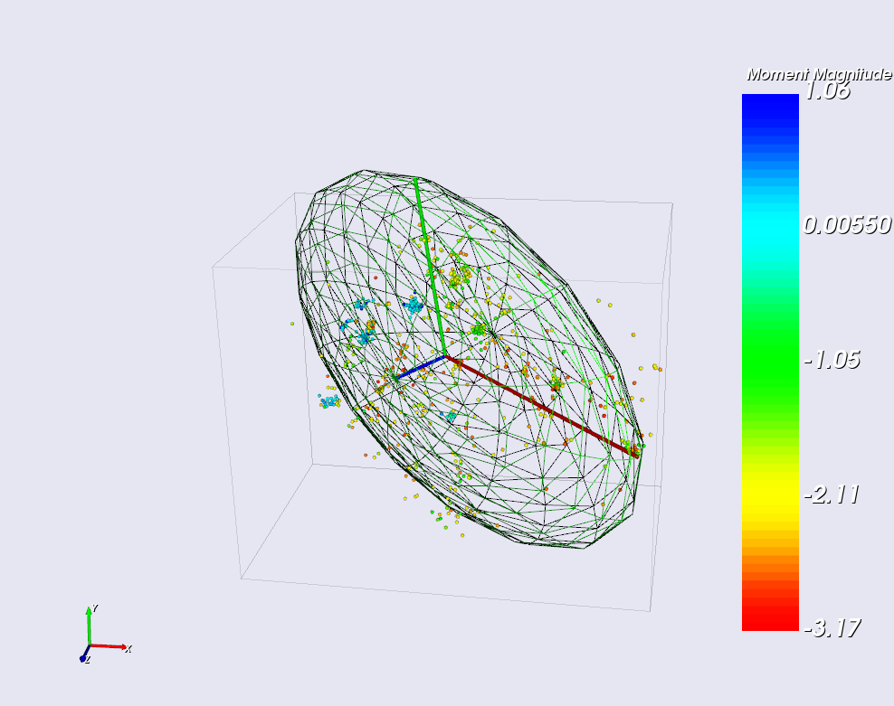
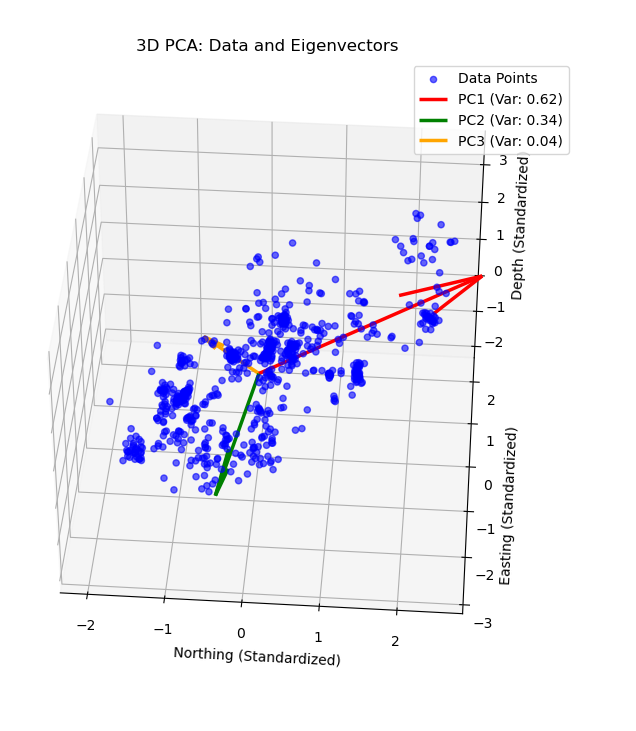

# -Voight-Kampff-test: Complete

> "Disclaimer: All code contained herein is original and not based on implanted memories."

This repository contains a **C++** application using the **Visualization Toolkit (VTK)**. It is designed to visualize seismic event data in 3D and perform **Principal Component Analysis (PCA)**.

Depends on: https://github.com/ESG-Solutions-Tech/-Voight-Kampff-test/tree/main.

## Project Overview

The primary goal of this project is to transform raw CSV seismic data into a 3D representation. Then, fit the data with PCA and plot an ellipsoid that encompasses the data.

## Building the Project

### Prerequisites

* **C++ Compiler**: Supporting C++11 or higher (GCC, Clang, MSVC).
* **CMake**: Version 3.10 or newer.
* **VTK**: 9.5. Please, follow the build instructions from -Voight-Kampff-test.

### Build Instructions

**Note:** I do not have programming environments set-up on my home PC Windows side and did not want to invest time/allocate space for it.
Therefore, I used wsl and worked on this project using Ubuntu 24.04.2 LTS, so my compilation steps are slightly different.
However, I would expect the code to be compilable with Visual Studio as well.

1.  Navigate to vtk_challenge.
2.  Create a build directory in vtk_challenge:
    ```bash
    mkdir build
    cd build
    ```
3.  Configure the project using CMake:
    ```bash
    cmake -DVTK_DIR:PATH=<PATH_TO_VTK_BUILD> ..
    ```
4.  Compile the executable:
    ```bash
    make
    ```

## Running the Application

The application requires a CSV file containing seismic event data (`Northing`, `Easting`, `Depth`, `Magnitude`).

**Command Syntax:**
```bash
./vtk_challenge <path_to_csv_file>
```

## Result

When the code is executed an interactive window pops up.
The window contains points of seismic activity colored accordingly to their magnitudes, a color scale, PCA analysis eigenvectors plotted in different colors,
a wirecube that shows the edge of the data, and an ellipsoid that was build from PCA analysis (3-sigma scale).



The console output contains some information about the data and PCA analysis results. Example:
```
Table has 757 rows and 4 columns.
Column 0: Northing
Column 1: Easting
Column 2: Depth
Column 3: Moment Magnitude

--- Array Type Debugging ---
Northing column type is: vtkIntArray
Detected Magnitude Range: [-3.167, 1.063]
Eigenvector 0 = ( 0.707226, -0.002129,  0.706984)
Eigenvector 1 = (-0.108212,  0.987886,  0.111223)
Eigenvector 2 = (-0.698657, -0.155164,  0.698429)

--- PCA Results ---
Eigenvalue 0 = 252032.715501
Eigenvalue 1 = 109936.470310
Eigenvalue 2 = 11296.765374
-------------------
```


## Verification: C++ vs. Python

I initially used python for PCA analysis since I had not done it before and wanted to familiarize myself with the algorithm first.

Then, I used the script also to ensure that the C++ VTK implementation makes sense.
The PCA resulting eigenvectors are cross-referenced against a python version with numpy and sklearn.
A Python script is provided (scripts/test_pca.py).

C++ eigenvectors:
```
Eigenvector 0 = ( 0.707226, -0.002129,  0.706984)
Eigenvector 1 = (-0.108212,  0.987886,  0.111223)
Eigenvector 2 = (-0.698657, -0.155164,  0.698429)
```

Python eigenvectors:
Eigenvectors (Principal Components):
```
[[ 0.70698398 -0.00212855  0.70722636]
 [-0.11122305 -0.98788646  0.10821167]
 [-0.69842901  0.15516379  0.69865665]]
```
Slightly different, but close enough.

Visualization of python plot:


